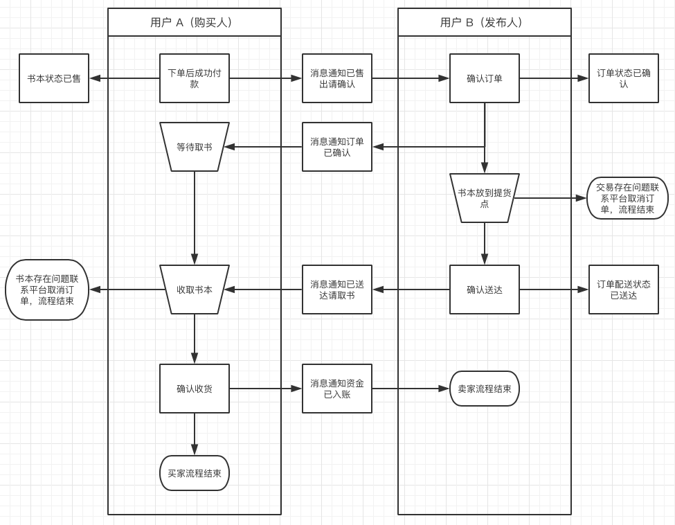
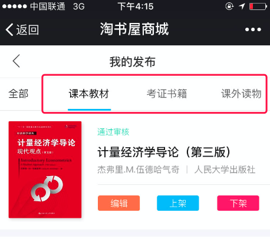
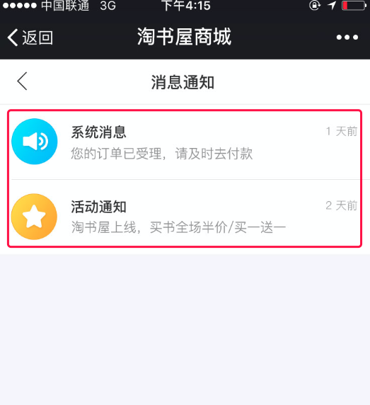
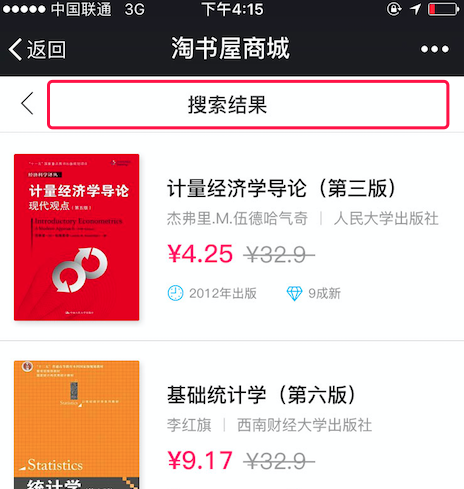
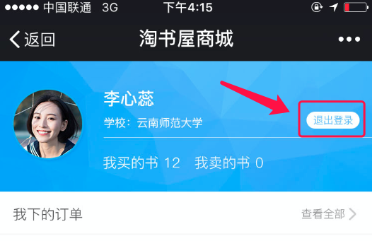

客户您好！
作为本项目的具体负责人，我已经仔细阅读了您所提供的功能需求，并对相关界面进行了分析。目前项目已进入编码阶段。为了保证您能拿到一个优秀的产品，我们需要进行更加充分的沟通，在此期间我将多次通过文档的形式与您沟通项目情况，请您`仔细阅读，及时反馈`。项目的具体功能，只会以双方已经达成共识文档为准，为此给您带来的麻烦请多多谅解！

文档通常包括：需求文档，系统设计文档，测试文档及开发进度安排，形式并不重要，其目的是客户及开发人员之间的充分沟通。

文档是程序员花费大量时间总结分析而来，书写文档让我们更好的思考，思考让我们更快的发现问题。同时文档也是您购买的服务中的一部分，最终整理后将全部交付给您。

# 分析

淘书屋是我们的项目名称，是一个帮助在校学生进行二手书交易的微商城。
我将从产品的角度上分析淘书屋的需求，让我们对即将开发的项目有更深入的理解，我将从以下三种元素入手：

1. 角色
2. 信息
3. 动作

接下来做单独分解。

## 1.角色

在淘书屋里会出现以下角色：

* 游客——没有登录的用户
* 用户——微信注册用户，可以进行书籍发布、购买
* 管理员——辅助站长做内容管理
* 站长——权限最高的用户角色，有时也叫超级管理员

## 2.信息结构

主要信息有：

* 学校 School——书本属于学校，学校对应一个收/取货点
* 用户 User——所有内容都围绕用户来进行，采用微信自动登录方式验证
* 书本 Book——项目的核心数据，可以由用户发布，但需要管理员审核
* 分类 Category——书本分类，一个分类下有多本书
* 订单 Order——用户购买书本的凭证
* 提现申请 Transfer——记录用户的提现操作
* 消息通知 Notice——向用户反馈信息
* 广告 Advertising——在首页进行展示

## 3.动作

角色和信息之间的互动称为动作，主要有以下几种：

* 用户注册
* 用户发布书本
* 管理员审核
* 用户下单
* 用户支付
* 用户维护订单信息
* 用户提现

## 用例

角色主要用例：

### 1.游客

* 游客可以创建用户（仅游客可用）
* 游客可以查看书本列表
* 游客可以根据分类筛选书本
* 游客可以根据发布时间和价格对书本进行排序
* 游客可以查看单个书本详情

### 2.用户

* 用户可以创建订单
* 用户可以使用微信内 JS 支付进行付款
* 用户可以对订单状态进行修改（后面会详细描述）
* 用户可以创建书本
* 用户可以编辑书本（编辑后需要重新审核）
* 用户可以控制是否显示书本（仅自己发布的）
* 用户可以查看个人信息界面
* 用户可以对昵称、头像、性别、手机号、所属学校进行修改
* 用户可以创建提现申请
* 用户可以查看消息通知

### 3.管理员

* 管理员可以访问后台
* 管理员可以编辑所有书本
* 管理员可以修改书本审核状态
* 管理员可以查看提现记录
* 管理员可以对提现记录状态进行修改
* 管理员可以为书籍增加`推荐`属性

### 4.站长

* 站长可以编辑用户
* 站长可以修改站点设置
* 站长可以管理[^1]分类
* 站长可以管理学校
* 站长可以管理广告
* 战场可以查看数据统计

## 流程

在项目制作过程中流程往往容易存在信息不对称的情况，我们对以下几个比较有争议的流程进行分析：

### 1. 审核流程

用户发布书本审核总共存在四个状态：待审核、审核通过、审核不通过、已售

* 仅展示审核通过的书本
* 修改之后需要重新审核
* 审核不通需要展示拒绝的原因
* 审核通过后默认为`上架`状态
* 只有审核通过的数据可以进行上下架操作
* 任何状态下都可进行`删除`操作
* 管理员只能对`待审核`状态的书本进行审核操作
* 已售状态书籍无法进行修改操作

### 2. 订单流程

订单总共有以下状态：

1. 待付款——此时卖家可以查看
2. 待确认——卖家需要进行订单确认
3. 待发货——等待卖家送书
4. 待取货——等待买家取书
5. 已完成
6. 已取消

我们将按照以下流程进行开发：

### 3. 消息通知

消息通知的方式包括以下两种：
* 短信通知
* 站内通知（非推送）

### 3. 提现流程

* 提现方式为`管理员线下人工打款到支付宝账户`，后台将提供支付宝账号、收款姓名等参考信息
* 首次提现需要登记收款支付宝
* 申请提现之后会`立即`扣除用户余额
* 提现申请状态包括：待打款、已打款
* 待打款提现申请可由管理员确认打款，将记录打款操作人员
* 已打款申请不可再修改

## 细节

有一些细节虽然看起来很小，但是随着项目的推进，修改难度会大大增加，我们对以下几个比较有争议的细节进行分析：

1. 书本的发布和购买数量总是为`1`
2. `1个`学校只拥有`1个`取货地址
3. 平台分成采用`后台统一设置百分比`的方式，无论任何人卖出何种书籍，卖书人的账户余额总是增加书价的`90%`（可改）
3. 遇到购物流程争议的处理方式为`用户主动联系平台`，争议包括但不限于书本遗失、损毁，订单退款、退货，信息错误等
4. 由于本项目为微商城，所以支付方式`仅有微信公众号内支付`一种，此种方式只能够在微信内部使用

## 界面调整

设计师的职责是让项目变得好看，而我们希望让项目变得好用，所以最终产品将与设计图存在部分差异，请您谅解。
比较重要的调整如下：

### 1.用户查看自己发布的书本，不再使用分类筛选，改用书本状态（待审核、审核通过、审核不通过、已售）

### 2.项目需要新增手机号快速注册的流程，会员首次使用手机号码注册后将会自动绑定微信，今后不需要再次登录（设计中）

### 3.消息通知将不再分类为系统消息和活动通知，改为直接展示消息内容，以此减少页面层级

### 4.搜索结果界面顶部将继续保留搜索框，方便更换关键词

### 5.首页将进行删减，我们保留`好书推荐`用于读取管理员推荐的好书，另外保留`最新图书`让用户快速浏览。`热卖图书`和`特惠图书`模块，由于不符合项目运营实际情况，将被删除。

### 6.发布图书过程中需要进行选择的字段不再去新页面选择，而是在本页下方弹出以供选择

### 7.由于存在微信自动登录的前提，退出登录将没有任何意义，予以删除

### 8.订单部分的入口，各个按钮在逻辑上是比较混乱的。我们将修改为两排订单，卖家订单和买家订单的入口分离，各个状态也将重新安排。

***

第一次发送给客户：2018年2月23日
客户反馈对内容没有疑问：2018年2月24日 08:52

[^1]:管理默认指具有增加、删除、修改、查询功能

